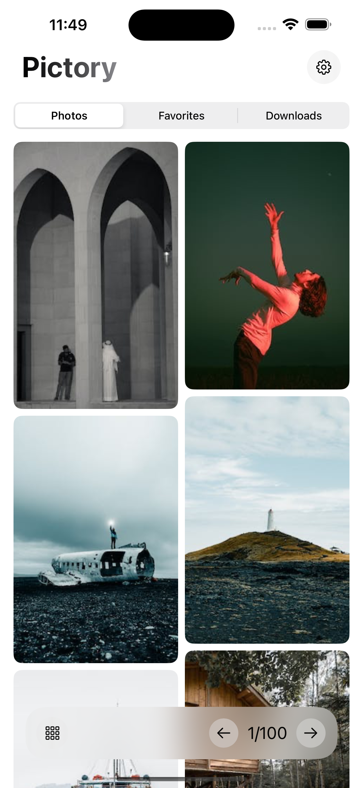

# Pictory (iOS)

This is an app resulting from a set of studies on developing mobile applications for iOS with SwiftUI

```SQLite```, ```CoreData``` and ```UserDefaults``` concepts were used

* **```SQLite```**: To save favorites
* **```CoreData```**: To save internal downloads
* **```UserDefaults```**: To save value settings


<p float="left;padding=10px">
<a href="https://apps.apple.com/app/pub.dev/id1526026915"> </a>  
 </p>  

## 📸 Preview


## 📸 Screenshots

<p float="left">
  
  
   
   
   
   
   
   
</p>
# Support

You liked this package? then give it a star. If you want to help then:

* Start this repository
* Send a Pull Request with new features
* Share this package
* Create issues if you find a Bug or want to suggest something
